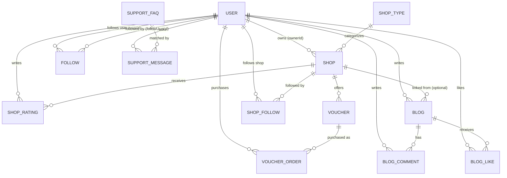

# LifeCompass 项目设计与实现详解

> 本文档面向想要理解整个项目内部实现的读者（包括未来的自己），用中文详细讲解设计思路、
> 数据库实体关系、接口设计、几个有一定难度的实现细节，以及关键第三方依赖的调用链路。
> 英文版的功能清单/接口速查表见根目录的 [README.md](README.md)，两者可以配合阅读：
> README 偏"是什么"，本文偏"为什么这么做、内部是怎么跑起来的"。

## 目录

- [一、项目定位](#一项目定位)
- [二、技术栈与依赖版本](#二技术栈与依赖版本)
- [三、整体架构](#三整体架构)
- [四、数据库实体关系](#四数据库实体关系)
- [五、认证体系：三种登录方式的完整链路](#五认证体系三种登录方式的完整链路)
- [六、几个有难度的实现细节](#六几个有难度的实现细节)
- [七、接口总览](#七接口总览)
- [八、前端架构与状态管理](#八前端架构与状态管理)
- [九、关键依赖的调用过程](#九关键依赖的调用过程)
- [十、踩过的坑与设计取舍](#十踩过的坑与设计取舍)

---

## 一、项目定位

LifeCompass 是一个面向爱尔兰本地生活的"点评/优惠券"类应用，界面风格参考了"黑马点评"教学项目，
但业务规则、UI 文案、数据库内容全部是英文，面向真实的爱尔兰用户场景（货币是欧元、地址是都柏林/科克等城市）。

核心用户旅程：

1. 用户通过 Google 一键登录 / 手机短信验证码登录 / 邮箱密码登录（后者主要给商户和管理员用）。
2. 浏览/搜索店铺，给店铺打分评论。
3. 发帖分享体验（可以关联某个店铺），点赞、评论、关注感兴趣的人。
4. 购买店铺发布的优惠券（普通券 / 限量券，限量券要处理超卖问题）。
5. 商户登录后管理自己名下店铺的优惠券。
6. 管理员对帖子/评论做内容审核（加精、删除）。

在这之上，还叠加了一套"个人中心"体系：关注数/粉丝数、经验值与 PRO 徽章、我的点评/帖子/评论/点赞/订单列表，
以及一个基于关键词匹配的客服悬浮窗。

---

## 二、技术栈与依赖版本

### 后端 (`pom.xml`)

| 依赖 | 版本 | 用途 |
|---|---|---|
| Spring Boot | 3.5.16 | 整体框架，内嵌 Tomcat |
| Java | 17 | 语言版本 |
| mybatis-plus-spring-boot3-starter | 3.5.12 | ORM，在 MyBatis 基础上提供 `LambdaQueryWrapper`、`BaseMapper` 等增强 |
| mybatis-plus-jsqlparser | 3.5.12 | MyBatis-Plus 3.5.9 之后分页拦截器等功能被拆到这个包，必须单独引入 |
| spring-boot-starter-security | — | 认证授权框架，这里只用它的过滤器链 + 方法级权限注解，不用它的 Session/表单登录 |
| spring-boot-starter-data-redis | — | Redis 客户端，这里只用 `StringRedisTemplate` 存短信验证码 |
| jjwt-api / jjwt-impl / jjwt-jackson | 0.12.6 | 签发和解析 JWT（无状态登录令牌） |
| google-api-client | 2.7.2 | 校验前端传来的 Google ID Token |
| twilio | 10.6.10 | 发送短信验证码 |
| mysql-connector-j | 运行时 | MySQL 8 驱动 |
| lombok | — | `@Data`/`@RequiredArgsConstructor` 减少样板代码 |

### 前端 (`frontend/package.json`)

| 依赖 | 版本 | 用途 |
|---|---|---|
| react / react-dom | 19.2.7 | UI 框架 |
| react-router-dom | 7.18.1 | 前端路由 |
| axios | 1.18.1 | HTTP 客户端，封装了统一的响应解包和 JWT 注入 |
| vite | 8.1.1 | 开发服务器 + 构建工具，`vite.config.ts` 里配置了 `/api`、`/images`、`/uploads` 三个反代到后端 8080 端口 |
| typescript | ~6.0.2 | 类型系统 |

---

## 三、整体架构

后端**按业务域（domain）而不是按技术分层（controller/service/dao 三层)组织包结构**，
每个业务域自己拥有 controller、service、dto：

```
src/main/java/com/albertchow/lifecompass/
├── auth/          登录注册：AuthController + AuthService，DTO 都在 auth/dto/
├── shop/          店铺浏览、店铺关注、店铺打分（ShopController / ShopRatingController / AdminShopController）
├── blog/          帖子、评论、点赞、管理员审核
├── voucher/       优惠券浏览购买 + 商户券管理
├── user/          个人中心：统计数据、资料编辑、"我的 XX" 各种列表、经验值计算、用户间关注
├── support/       客服悬浮窗 + 后台 FAQ 管理
├── upload/        图片上传接口 + 静态资源映射配置
├── security/      JWT 签发/解析、Spring Security 配置、Google/Twilio 的 Bean 装配
├── common/        统一响应体 Result、枚举、异常类型、全局异常处理器
├── entity/        MyBatis-Plus 实体类，一张表对应一个类
├── mapper/        MyBatis-Plus Mapper 接口，多数直接继承 BaseMapper，少数补充自定义 @Select
└── config/        MyBatis-Plus 自动填充等全局配置
```

这样组织的好处：改一个功能（比如"点评"）时，相关的 Controller、Service、DTO 都在 `shop/` 目录下，
不用在 `controller/xxx`、`service/xxx`、`dto/xxx` 三个平行目录之间来回跳。
代价是 `entity/` 和 `mapper/` 仍然是按技术层组织的——因为实体和 Mapper 经常被多个业务域共享
（比如 `BlogService` 会用到 `FollowMapper`、`user` 包下的服务也会用到 `Blog`/`BlogComment` 实体），
放在一个公共位置比按业务域拆分更省心。

前端按"页面 / 组件 / 上下文 / API"分层：

```
frontend/src/
├── pages/       每个路由一个组件（ShopListPage、PostsPage、ProfilePage、MyOrdersPage ...）
├── components/  跨页面复用的 UI：Navbar、UserMenu（头像下拉菜单）、Banner、SupportWidget、
│                PostComments、RequireAuth/RequireRole（路由守卫）
├── context/     AuthContext——全局登录态
├── api/client.ts 统一的 axios 实例：自动注入 JWT、统一解包 Result 信封
├── hooks/       useGoogleIdentityScript——按需异步加载 Google 登录脚本
├── types.ts     和后端 entity/DTO 对应的 TypeScript 类型
└── format.ts    金额格式化、星级、取首图等小工具函数
```

---

## 四、数据库实体关系

### 4.1 ER 图



### 4.2 各表字段与要点

**`user`（账号表）**

| 字段 | 说明 |
|---|---|
| id | 主键 |
| phone | E.164 格式手机号，短信登录用 |
| email | 邮箱，Google 登录 / 邮箱密码登录用 |
| googleId | Google 返回的 `sub` claim，用于绑定 Google 账号 |
| password | BCrypt 哈希，`@JsonIgnore` 保证不会被序列化返回给前端 |
| nickName / icon / city | 展示用基础资料 |
| role | `USER` / `MERCHANT` / `ADMIN`，三种角色共用一张表 |
| status | 1 正常，0 封禁——封禁账号登录时会在 `AuthService.issueToken` 里被拦截 |

一个账号可以**同时**具备邮箱密码、Google、手机号三种登录方式（比如先用邮箱注册，之后又绑定了 Google）——
`AuthService.loginWithGoogle` 里如果 `googleId` 查不到用户，会退一步用 `email` 去匹配已有账号并补上 `googleId`，
而不是无脑新建一条重复账号。

**`shop` / `shop_type`**

- `shop.score` 存的是**平均分 × 10**（整数 0~50），是为了避免浮点数在数据库和 JSON 序列化里的精度问题，
  前端拿到后除以 10 展示成 "4.6★"。
- `shop.avgPrice` 和 `voucher.payValue` / `voucher.actualValue` 全部以**欧分（cent）为单位的整数**存储，
  同样是为了规避金额浮点误差（`€12.50` 存成 `1250`）。
- `shop.sold` / `shop.comments` 是冗余的聚合字段，分别在优惠券购买成功、点评提交/删除时被动更新，
  换取"店铺列表页不用现场 `COUNT()`/`SUM()`"的读性能。

**`shop_rating`（点评历史表）**

这张表是本项目里少数"故意不加唯一约束"的表——最初的 schema 是 `UNIQUE(shop_id, user_id)`，
也就是一个用户对一家店只能有一条评价记录，再次评价就是更新。后来产品需求变成"同一家店可以隔一段时间再评一次"，
于是把唯一索引换成了普通索引 `idx_shop_user`，`shop_rating` 变成一张**追加写入的历史表**，
每次评价都是一条新记录，配合应用层的两条限流规则（见第六节）防止刷分。

**`blog` / `blog_comment` / `blog_like`**

- `blog.liked` / `blog.comments` 同样是冗余计数字段，点赞/评论时同步更新，避免详情页现场 `COUNT()`。
- `blog_comment` 用 `parentId` + `answerId` 两个字段支持一层楼中楼的回复结构（`parentId` 指向所属的顶层评论，
  `answerId` 指向被回复的那条评论本身，都是 0 表示顶层评论）。
- `blog_like` 除了驱动点赞按钮的状态，还是经验值计算的原始数据源（见第六节）。

**`voucher` / `voucher_order`**

- `voucher.type`：0 = 普通券（不限量），1 = 限量券（`stock` 字段生效，购买要保证不超卖）。
- `voucher.status`：1 上架、2 下架、3 过期——只有 1 会出现在公开的浏览列表里。
- `voucher_order` 记录一次购买，`payType` 目前固定写 1（模拟"卡内余额支付"，没有接入真实支付网关，
  这是一个刻意简化：优惠券购买场景本身不是本项目的核心难点，重点在于并发安全的库存扣减）。

**`follow`（用户关注用户） vs `shop_follow`（用户关注店铺）**

这是两张长得几乎一样、但语义完全不同的表，故意不合并成一张"通用关注表"：

- `follow.userId` 关注 `follow.followUserId`（人关注人，用于 Posts 页面的"关注的人"筛选）
- `shop_follow.userId` 关注 `shop_follow.shopId`（人关注店铺，用于个人中心的"关注的店铺"列表）

合并成一张多态表（比如加个 `targetType` 字段区分是关注人还是关注店铺）在这个规模下反而增加了查询复杂度
（每次查询都要多带一个 `WHERE target_type = ...` 条件，索引设计也更别扭），所以选择了拆成两张表、
两套独立的 Mapper（`FollowMapper` / `ShopFollowMapper`）。

**`support_faq` / `support_message`**

`support_faq.keywords` 是逗号分隔的关键词字符串（不是单独一张关键词表），匹配逻辑是应用层的
大小写不敏感子串匹配（见 `SupportService.findMatch`），对这个项目的规模来说足够用，也为将来换成
真正的 AI/向量检索留了迁移空间——`support_message` 已经把每一次问答都记录下来，不管有没有匹配到，
这正是训练或评估未来 AI 客服所需要的语料。

---

## 五、认证体系：三种登录方式的完整链路

整体是**无状态 JWT**：后端不保存任何会话，每次请求靠 `Authorization: Bearer <token>` 里的 JWT
自证身份。Token 里只编码了两个 claim：`sub`（用户 ID）和 `role`。

### 5.1 请求进来后怎么"认出"是谁

```
请求 → JwtAuthenticationFilter（每个请求都过一遍）
         │
         ├─ 有 Authorization: Bearer <token> 头？
         │     ├─ 没有 → 直接放行，走到 Security 的授权规则，未登录能访问的路由正常访问，
         │     │          需要登录的路由会在授权阶段被拒绝（401，由 AuthenticationEntryPoint 处理）
         │     └─ 有 → JwtUtil.parse(token)
         │              ├─ 解析失败（过期/篡改/格式错误）→ 直接吞掉异常，当成"匿名请求"处理
         │              │   （这里特意不抛出去，交给下游的授权规则统一决定要不要拒绝）
         │              └─ 解析成功 → 拿到 LoginUser(userId, role)
         │                    ├─ 写入 Spring SecurityContext（供 @PreAuthorize / hasRole(...) 用）
         │                    └─ 写入 UserContext（一个 ThreadLocal，供 Controller/Service 里
         │                                          直接 UserContext.require() 拿当前用户，不用
         │                                          到处注入 Authentication 对象）
         └─ finally 块：请求处理完一定清空 UserContext，避免线程池复用时脏读上一个请求的用户
```

`SecurityConfig` 里用 `authorizeHttpRequests` 声明了一份白名单（哪些路径不需要登录），
其余全部要求已认证；`/api/merchant/**` 要求 `MERCHANT` 角色、`/api/admin/**` 要求 `ADMIN` 角色。
认证失败/权限不足时没有走 Spring Security 默认的 HTML/纯文本错误页，而是自定义了
`authenticationEntryPoint` / `accessDeniedHandler`，统一写成项目自己的 `Result.fail(...)` JSON 格式，
保证前端 axios 拦截器处理错误的逻辑不用对 401/403 特殊分支。

### 5.2 Google 登录

```
前端                              后端 AuthService.loginWithGoogle
 │                                        │
 │ 1. 加载 Google Identity 脚本（懒加载，  │
 │    见 useGoogleIdentityScript）        │
 │ 2. 用户点击 Google 按钮，Google 弹窗    │
 │    完成身份验证后回调前端，拿到一个     │
 │    ID Token（一段 JWT，由 Google 签发） │
 │ 3. POST /api/auth/google { idToken } ─────► googleIdTokenVerifier.verify(idToken)
 │                                        │     （用 Google 的公钥验证签名 + 校验
 │                                        │      audience 是不是本项目的 Client ID）
 │                                        │
 │                                        │  验证通过后从 payload 里取 sub/email/name/picture
 │                                        │     ├─ 按 googleId 查用户
 │                                        │     ├─ 查不到但 email 能查到 → 绑定 googleId 到已有账号
 │                                        │     └─ 都查不到 → 新建 USER 账号
 │                                        │
 │ 4. ◄──────────────────────────────────── issueToken(user)：生成 JWT，返回 LoginResponse
 │ 5. 前端把 token 存进 localStorage，      │
 │    AuthContext.login(token) 触发         │
 │    GET /api/auth/me 拉取最新资料         │
```

`GoogleIdTokenVerifier` 这个 Bean 是在 `GoogleAuthConfig` 里一次性构建好的（`@Bean`），
内部维护了 Google 公钥的缓存，不用每次登录都重新拉取。

### 5.3 短信登录

```
第一步：POST /api/auth/sms/code { phone }
  AuthService.sendSmsCode
    ├─ 生成 6 位随机数字验证码（ThreadLocalRandom）
    ├─ 写入 Redis：key = "login:code:+353xxxxxxxxx"，value = 验证码，TTL = 5 分钟
    └─ TwilioSmsSender.send(phone, code)
          ├─ 如果没配置真实 Twilio 凭证 → 只打一条 WARN 日志把验证码打印出来（本地开发用）
          └─ 如果配置了 → Twilio.init(sid, token) 之后用 Message.creator(...).create() 真实发短信
                （Twilio 试用账号常见的坑：目标号码没在控制台加入 Verified Caller IDs 会报
                 ApiException，这里捕获后转成一条更友好的 BusinessException 消息）

第二步：POST /api/auth/sms/login { phone, code }
  AuthService.loginWithSms
    ├─ 从 Redis 按同样的 key 取出验证码，和用户输入的比对，不一致/过期（Redis 里已经没有）就拒绝
    ├─ 校验通过后立刻 redisTemplate.delete(key)——验证码一次性，防止重放
    ├─ 按 phone 查用户，查不到就新建一个 USER 账号（nickName 默认是 "User" + 手机号后四位）
    └─ issueToken(user)
```

`GET /api/auth/config` 是专门给前端用的一个小接口，返回 `smsConfigured: boolean`，
让登录页可以准确地告诉用户"这是真发短信"还是"演示模式验证码会打印在后端日志里"，
而不是每次都无脑宣称"验证码已发送"。

### 5.4 邮箱密码登录 / 注册

标准流程：`BCryptPasswordEncoder` 加密存储、登录时 `passwordEncoder.matches(raw, hash)` 校验。
唯一值得一提的设计：`RegisterRequest` 只允许选 `USER` 或 `MERCHANT`，**没有自助注册管理员这个选项**，
管理员账号只能通过 `sql/data.sql` 种子数据预先建好——这是有意为之的权限收敛，不是漏掉了。

---

## 六、几个有难度的实现细节

### 6.1 经验值：按天封顶后求和，且完全不落库

需求是"经验值和点赞数、发帖数、评论数挂钩，但每种操作每天有上限"，直接的做法是维护一个
`user.experience` 字段，每次点赞/发帖/评论时 `+= N`。但这样做有两个麻烦：

1. 每天的上限要在写入时校验"今天已经加过多少次"，等于每次写操作都要多查一次"今天的计数"，
   而且如果哪次写入漏了更新（比如删帖没扣回经验值），数字就永久错了，没有"重新对账"的手段。
2. 删除操作（删帖、删评论、取消点赞）都要对应地把经验值减回去，逻辑分散在好几个地方，容易漏。

所以最终选择把经验值设计成**完全派生（derived）、不落库**的值，每次读的时候现算：

```java
long fromPosts   = blogMapper.sumCappedDailyCount(userId, POST_DAILY_CAP)       * XP_PER_POST;      // 10 分/篇，每天最多算 3 篇
long fromComments= commentMapper.sumCappedDailyCount(userId, COMMENT_DAILY_CAP) * XP_PER_COMMENT;   // 2 分/条，每天最多算 10 条
long fromLikes   = likeMapper.sumCappedDailyLikesReceived(userId, CAP)          * XP_PER_LIKE;       // 1 分/赞，每天最多算 20 个
```

"每天封顶"这一步是用一条 SQL 完成的，以发帖为例（`BlogMapper.sumCappedDailyCount`）：

```sql
SELECT COALESCE(SUM(LEAST(daily_count, #{cap})), 0) FROM (
    SELECT COUNT(*) AS daily_count
    FROM blog
    WHERE user_id = #{userId} AND status = 1
    GROUP BY DATE(create_time)
) t
```

内层按 `DATE(create_time)` 分组，得到"每天发了几篇"；外层用 `LEAST(daily_count, cap)` 把每天的数字
夹到上限以内，再求和——也就是说如果某天发了 8 篇帖子，那天只按 3 篇计分，但不会倒扣，也不影响其他天。
点赞的版本多了一层 JOIN（`blog_like` 要 JOIN `blog` 才能知道这个赞是给谁的帖子点的，
因为经验值算的是"你的帖子收到了多少赞"，不是"你给别人点了多少赞"）。

这个设计的好处：新增/删除一条帖子、评论、点赞记录，经验值**自动**正确，不需要额外维护同步逻辑；
坏处是每次查经验值都要跑几条聚合 SQL，但个人中心这个场景的读频率不高，用空间换正确性、用计算换维护成本
是合算的。500 分解锁彩色 PRO 徽章的阈值（`ExperienceService.PRO_THRESHOLD`）也是纯前端展示逻辑的依据，
不需要额外状态机。

### 6.2 点评限流：月度总量 + 单店冷却，两条独立规则

需求原文是"单个用户每月最多评价 50 次，30 天内点评过的店铺不能再次点评"——注意这是**两条独立的规则**，
不是一条规则的两种表述：

```java
// 规则一：本自然月（从当月 1 号 0 点算起）已经提交过多少条评价
LocalDateTime startOfMonth = LocalDate.now().withDayOfMonth(1).atStartOfDay();
long ratedThisMonth = shopRatingMapper.selectCount(
    new LambdaQueryWrapper<ShopRating>()
        .eq(ShopRating::getUserId, userId)
        .ge(ShopRating::getCreateTime, startOfMonth));
if (ratedThisMonth >= MONTHLY_CAP) { 拒绝 }

// 规则二：过去 30 天（滑动窗口，不是自然月）有没有评价过这同一家店
LocalDateTime cooldownCutoff = LocalDateTime.now().minusDays(SAME_SHOP_COOLDOWN_DAYS);
boolean ratedRecently = shopRatingMapper.exists(
    new LambdaQueryWrapper<ShopRating>()
        .eq(ShopRating::getShopId, shopId)
        .eq(ShopRating::getUserId, userId)
        .ge(ShopRating::getCreateTime, cooldownCutoff));
if (ratedRecently) { 拒绝 }
```

两条规则都通过后才真正 `insert` 一条新的评价记录，然后 `recomputeShopScore` 重新从
`shop_rating` 表里现算这家店的评分条数和平均分（× 10 取整）回写到 `shop.comments` / `shop.score`。
删除自己的评价（`deleteMine`）走的是同一套"删了之后重新现算一遍"，保证 `shop.score` 永远和
`shop_rating` 表里的真实数据一致，不会因为某次更新漏掉而产生漂移。

这里能看出和 6.1 相似的设计哲学：**能现算就不维护冗余状态**，`shop.score`/`shop.comments`
是唯一的例外（做成冗余字段是为了列表页性能），但每次 `shop_rating` 表发生变化时都会同步重算，
不存在"冗余字段和源表不一致"的中间态。

### 6.3 优惠券库存扣减：原子 SQL，而不是"先查后扣"

限量优惠券最容易出的 bug 是超卖：如果代码写成"查询 `stock > 0` → 在 Java 里 `stock - 1` → `UPDATE`"，
两个并发请求可能同时读到 `stock = 1`，都以为自己能买，最终都扣成功，库存变成 -1。

这里的解法是把"检查库存是否够 + 扣减"合并成**一条原子 UPDATE**，把并发控制完全交给数据库的行锁：

```java
int updated = voucherMapper.update(null, new UpdateWrapper<Voucher>()
        .setSql("stock = stock - 1")
        .eq("id", voucherId)
        .gt("stock", 0));      // 条件里带上 stock > 0，而不是先查询再判断
if (updated == 0) {
    throw new BusinessException("This voucher is sold out");
}
```

`UPDATE voucher SET stock = stock - 1 WHERE id = ? AND stock > 0` 这条 SQL 本身是原子的：
MySQL 在执行这条语句时会对匹配到的行加锁，多个并发事务串行执行这条 UPDATE，`stock > 0` 这个条件
是在数据库层面、拿到锁之后才判断的，不存在"两个事务都读到旧值"的窗口期。返回值 `updated`
是这条 UPDATE 实际影响的行数——如果库存已经是 0，`WHERE ... AND stock > 0` 匹配不到任何行，
`updated` 就是 0，据此判断"卖光了"，而不需要额外的 `SELECT ... FOR UPDATE` 悲观锁或者版本号乐观锁。

普通（不限量）优惠券完全跳过这一步，直接进入下单流程——这也是为什么 `type` 字段要单独判断，
不是所有优惠券都需要走库存扣减这条路径。

### 6.4 MyBatis-Plus 自动填充时间戳

几乎每张表都有 `createTime`/`updateTime` 两个字段，如果每个 Service 手写 `xxx.setCreateTime(LocalDateTime.now())`，
一是啰嗦，二是容易有的地方忘写。MyBatis-Plus 提供了 `MetaObjectHandler` 这个扩展点，实现一次、全局生效：

```java
@Component
public class TimestampMetaObjectHandler implements MetaObjectHandler {
    @Override
    public void insertFill(MetaObject metaObject) {
        LocalDateTime now = LocalDateTime.now();
        this.strictInsertFill(metaObject, "createTime", LocalDateTime.class, now);
        this.strictInsertFill(metaObject, "updateTime", LocalDateTime.class, now);
    }
    @Override
    public void updateFill(MetaObject metaObject) {
        this.strictUpdateFill(metaObject, "updateTime", LocalDateTime.class, LocalDateTime.now());
    }
}
```

配合实体类字段上的 `@TableField(fill = FieldFill.INSERT)`（只在插入时填充，比如 `createTime`）或
`@TableField(fill = FieldFill.INSERT_UPDATE)`（插入和更新都填充，比如 `updateTime`），
MyBatis-Plus 会在生成 INSERT/UPDATE 语句前自动调用这个 Handler 把值塞进对应字段。
好处是 Service 层代码完全不用关心时间戳，`new Blog()` 之后哪怕不设置 `createTime`，
`insert()` 一执行完，返回的实体对象上这两个字段已经是准确值了——不需要再发一次 `SELECT`
去读数据库 `CURRENT_TIMESTAMP` 默认值才能拿到，这在"创建后立刻把对象序列化返回给前端"的场景里很关键
（比如 `BlogService.create` 插入后直接 `enrich(List.of(blog))` 返回，`blog.createTime` 已经有值）。

有些表（比如 `follow`、`shop_follow`、`blog_like`）只有 `createTime`、没有 `updateTime`，
因为这些是"纯粹的关联记录"，不存在"更新"这个操作——语义上不需要 `updateTime`。

### 6.5 图片上传目录必须在 classpath 之外

这是一个真实踩过的坑，值得记录设计理由：`FileUploadController` 把上传的文件写到项目根目录下的
`uploads/` 目录（`Paths.get("uploads")`），而不是 `src/main/resources/static/uploads/`。

原因是 Spring Boot 默认的静态资源处理器只会服务**打包时打进 classpath**（也就是编译到 `target/classes`
里）的文件。如果把上传目录设在 `src/main/resources/static/` 下面，本地开发时后端进程运行时写入的新文件
只存在于磁盘的 `src/main/resources/static/uploads/`，但 Spring 的静态资源处理器实际读的是
`target/classes/static/uploads/`（或者打包后 jar 内部的路径）——这个目录只在**编译/打包时**被复制一次，
运行时新写入的文件永远不会被同步过去，导致刚上传完的图片访问 `/uploads/xxx.jpg` 直接 404。

解决方式是让上传目录彻底脱离 classpath，写到项目根目录的 `uploads/`，然后专门写一个
`UploadResourceConfig implements WebMvcConfigurer`，用 `addResourceHandler("/uploads/**")` +
`addResourceLocations("file:uploads/")` 手动把这个外部目录映射成一个 URL 路径。
`FileUploadController` 里也用 `Files.createDirectories(UPLOAD_DIR)` 保证目录不存在时自动创建，
不需要提前手动 `mkdir`。

配套的还有一个前端开发环境的坑：Vite 的 dev server 默认只反代配置里写明的路径，最初
`vite.config.ts` 只配了 `/api` 的代理，`/uploads` 和店铺种子图片所在的 `/images` 没配，
导致开发环境下这两类图片请求全部落到 Vite 自己头上、返回的是 SPA 的 `index.html`
（因为 SPA 路由兜底），而不是真正的图片——这个 bug 已经修复,`vite.config.ts` 现在同时代理
`/api`、`/images`、`/uploads` 三个前缀。

### 6.6 前端"关注 Following"筛选：无副作用地兼容匿名访问

`GET /api/blog?followedOnly=true` 是唯一一个"公开可访问的路径，但行为依赖登录态"的接口——
`/api/blog/**` 整体在 `SecurityConfig` 里是 `permitAll` 的（未登录也能看帖子列表），
但"只看我关注的人的帖子"这个筛选显然需要知道"我是谁"。

`BlogService.list` 的处理方式是：如果请求带了 `followedOnly=true`，但 `UserContext.get()`
返回 `null`（说明请求没带有效 JWT，也就是没登录），直接返回空列表 `List.of()`，而不是抛
`401` 异常。这样设计是因为这个筛选参数本质上是"可选的个性化视图"，不是"受保护的资源"——
一个未登录用户点击"Following"筛选（虽然前端 UI 上这个选项本来就只在登录后才显示），
后端也不应该报错打断体验，返回一个空列表是更符合直觉的降级行为。

---

## 七、接口总览

完整的接口表格（方法、路径、权限、说明）见 [README.md 的 API reference 一节](README.md#api-reference)，
这里只按业务域画出调用关系，避免和 README 重复维护同一份表格。

```
/api/auth/*         公开：登录注册相关，唯一的例外是 /api/auth/me 需要登录
/api/shop/*          公开可读；关注/打分动作需要登录
/api/shop-type/*     公开可读
/api/admin/shop/*    仅 ADMIN
/api/blog/*          公开可读；发帖/点赞/评论需要登录
/api/admin/blog/*    仅 ADMIN（加精、软删除帖子/评论）
/api/voucher/*       公开可读；购买需要登录
/api/merchant/voucher/*  仅 MERCHANT（且只能操作自己名下店铺的券）
/api/support/ask     公开（登录与否都能问）
/api/admin/support/* 仅 ADMIN
/api/user/*          全部需要登录（个人中心）
/api/upload          需要登录
```

所有接口统一返回 `Result<T>` 信封：`{ success, errorMsg, data, total }`。这个信封由
`common/Result.java` 定义，`GlobalExceptionHandler` 负责把业务异常（`BusinessException`）、
资源不存在（`NotFoundException`）、参数校验失败（`MethodArgumentNotValidException`）等
统一转换成 `Result.fail(message)`，保证前端 `apiErrorMessage()` 只需要认一种错误结构。

---

## 八、前端架构与状态管理

### 8.1 登录态：AuthContext

```
App 挂载
  │
  ├─ localStorage 里有 token？
  │     ├─ 没有 → loading = false，user = null（游客状态）
  │     └─ 有 → 调 GET /api/auth/me 重新校验
  │              ├─ 成功 → user = 从响应里解出的 { userId, nickName, role, icon }
  │              └─ 失败（token 过期/无效）→ 清掉 localStorage 里的 token，user = null
  │
  └─ 之后任何组件都用 useAuth() 读 user / login() / logout() / refresh()
```

关键设计点：**永远不直接信任 localStorage 里缓存的用户信息**，每次都用 `/api/auth/me`
重新校验+拉取最新资料。这样即使用户在个人资料页把头像换了，或者被管理员改了角色，
下次刷新页面也能拿到最新状态，而不是显示一个过期快照。`refresh()` 方法就是给
"编辑资料保存成功后，需要让 Navbar 上的头像立刻更新"这种场景用的，不用重新登录。

### 8.2 API 调用:统一的 axios 实例

```ts
export const api = axios.create({ baseURL: '/api', timeout: 10_000 })

api.interceptors.request.use((config) => {
  const token = localStorage.getItem('token')
  if (token) config.headers.Authorization = `Bearer ${token}`
  return config
})
```

所有页面统一 `import { api } from '../api/client'` 然后 `api.get(...)`/`api.post(...)`，
不需要每个调用点自己拼 `Authorization` 头。配合 `apiErrorMessage(err, fallback)` 这个辅助函数，
错误处理的样板代码变成一行：`catch (err) { setError(apiErrorMessage(err, '默认错误文案')) }`。

### 8.3 路由守卫

`RequireAuth`（任意已登录角色都能进）和 `RequireRole`（限定角色，比如商户后台页面只有
`role === 'MERCHANT'` 能进）是两个独立的守卫组件，没有合并成一个"传角色数组"的通用组件——
因为 `RequireAuth` 语义上是"任何人登录了就行"，`RequireRole` 是"必须是特定角色"，
分开写让每个路由配置一眼就能看出这条路由的权限意图，不需要去看数组参数才知道限制了哪些角色。

---

## 九、关键依赖的调用过程

这一节把第五、六节里出现过的几个"第三方 SDK 具体怎么调"单独抽出来，按依赖分类，方便查阅。

### 9.1 jjwt（JWT 签发与解析）

```java
// 签发（JwtUtil.generate）
Jwts.builder()
    .subject(String.valueOf(userId))
    .claim("role", role.name())
    .issuedAt(now)
    .expiration(new Date(now.getTime() + expirationMillis))
    .signWith(key)          // key 由 Keys.hmacShaKeyFor(secret.getBytes(UTF_8)) 构建，HMAC-SHA 对称密钥
    .compact();

// 解析（JwtUtil.parse）
Jwts.parser()
    .verifyWith(key)        // 用同一把密钥验签
    .build()
    .parseSignedClaims(token)
    .getPayload();           // 拿到 Claims，读 subject 和自定义 claim "role"
```

密钥来自配置项 `lifecompass.jwt.secret`（映射到环境变量 `LIFECOMPASS_JWT_SECRET`），
过期时间默认 604800 秒（7 天），可通过 `lifecompass.jwt.expiration-seconds` 覆盖。
`JwtUtil` 是无状态的：不管 Token 是不是这台服务器签发的，只要密钥一致就能验证通过，
这也是为什么密钥泄露是严重问题——本项目为此专门做过一次"隐藏数据库密码 + JWT 密钥、
不再提交到 Git"的整改（历史提交里曾经泄露过，用户明确要求不轮换旧密码、只保证以后不再泄露）。

### 9.2 google-api-client（Google 登录校验）

```java
// 装配（GoogleAuthConfig，应用启动时一次性构建，之后复用）
new GoogleIdTokenVerifier.Builder(new NetHttpTransport(), GsonFactory.getDefaultInstance())
    .setAudience(Collections.singletonList(clientId))   // 只接受签发给本项目 Client ID 的 token
    .build();

// 调用（AuthService.loginWithGoogle）
GoogleIdToken idToken = googleIdTokenVerifier.verify(idTokenString);
// verify() 内部会做三件事：
//   1. 校验 JWT 签名是否匹配 Google 公开的签名公钥（内部维护公钥缓存，定期刷新）
//   2. 校验 audience（aud claim）是否等于我们配置的 Client ID
//   3. 校验 token 是否在有效期内（Google 签发的 ID Token 通常只有 1 小时有效期）
// 三者任一失败，verify() 返回 null 或抛出异常，都会被 AuthService 转换成统一的 BusinessException
```

前端配合的部分是 `useGoogleIdentityScript` 这个 hook：懒加载 `accounts.google.com/gsi/client`
这个官方脚本（不在 `index.html` 里写死 `<script>` 标签，避免没用到 Google 登录的页面也加载它），
脚本加载完成后调用 `window.google.accounts.id.initialize({...})` 和 `renderButton(...)`
渲染出官方样式的登录按钮,用户点击后 Google 在弹窗里完成认证，通过回调把 ID Token 交给前端,
前端原样转发给后端的 `/api/auth/google`，后端全程不需要知道用户的 Google 密码,只信任 Google
签名过的 Token。

### 9.3 Twilio（短信发送）

```java
// 初始化：只有三个凭证都非空时才真正 Twilio.init(accountSid, authToken)
this.configured = !accountSid.isBlank() && !authToken.isBlank() && !fromNumber.isBlank();
if (configured) { Twilio.init(accountSid, authToken); }

// 发送
Message.creator(new PhoneNumber(toPhone), new PhoneNumber(fromNumber), body).create();
// Message.creator(...) 返回一个 MessageCreator（Builder 模式），.create() 才真正发起 HTTPS 请求
// 调用 Twilio 的 REST API，同步等待发送受理结果（不是等短信送达，只是"Twilio 已接收发送请求"）
```

`isConfigured()` 这个开关贯穿了整条链路：`AuthController.config()` 把它暴露给前端决定登录页文案，
`TwilioSmsSender.send()` 内部也用它决定是"真发"还是"打日志"——这让开发环境不需要一个真实的
Twilio 付费账号也能完整走通短信登录流程（验证码直接出现在后端控制台日志里）,只有配置了
`TWILIO_ACCOUNT_SID`/`TWILIO_AUTH_TOKEN`/`TWILIO_FROM_NUMBER` 三个环境变量后才会真的发短信。

### 9.4 Spring Data Redis（短信验证码存储）

用的是最基础的 `StringRedisTemplate`，没有引入更复杂的 Redisson 之类的库,因为这里的需求
只是"存一个字符串、带过期时间、用完删除"，`opsForValue().set(key, value, ttl)` /
`opsForValue().get(key)` / `delete(key)` 三个操作就够了：

```java
redisTemplate.opsForValue().set(SMS_CODE_KEY_PREFIX + phone, code, SMS_CODE_TTL);  // SETEX，5 分钟过期
String cached = redisTemplate.opsForValue().get(key);                              // GET
redisTemplate.delete(key);                                                          // DEL，验证后立即失效，防重放
```

Redis 在这里被当成一个"带 TTL 的键值缓存"用，不是消息队列也不是持久化存储——即使 Redis 里的
验证码丢失（比如 Redis 重启），最坏后果只是用户要重新点一次"发送验证码"，不影响数据完整性,
所以选它而不是写数据库表存验证码，图的就是原生 TTL 支持 + 不需要额外清理过期数据的定时任务。

### 9.5 MyBatis-Plus（`LambdaQueryWrapper` / `UpdateWrapper`）

项目里绝大多数查询走 `LambdaQueryWrapper<T>`，好处是条件用方法引用写（`ShopRating::getUserId`
而不是字符串 `"user_id"`），改字段名时编译期就能发现漏改的地方,例如：

```java
shopRatingMapper.selectCount(new LambdaQueryWrapper<ShopRating>()
    .eq(ShopRating::getUserId, userId)
    .ge(ShopRating::getCreateTime, startOfMonth));
```

少数需要"原子自增/自减"或者"只更新某一列而不触发整行覆盖"的场景（优惠券库存扣减、店铺
`sold` 计数）改用普通的 `UpdateWrapper` + `.setSql("stock = stock - 1")`——因为
`LambdaQueryWrapper` 配合 `updateById` 是"读出整个对象再整行 UPDATE"的模式，没法表达
"在数据库端做 `column = column - 1` 这种依赖当前值的原子运算"，必须手写 SQL 片段。

---

## 十、踩过的坑与设计取舍

按时间顺序记录几个有代表性的、值得以后参考的决策：

1. **`shop_rating` 从"一人一店一条记录"改成历史表**——需求变化（要支持隔一段时间重新评价）
   驱动了唯一索引到普通索引的迁移,这是一个提醒:数据库约束要为将来大概率会变的产品需求
   留出弹性,不要过早用 `UNIQUE` 约束把business rule焊死在 schema 层——业务规则更适合放在
   应用层（本项目的月度上限 + 冷却期就是应用层校验），schema 层的约束应该只保留"任何情况下
   都不该被打破"的不变量。

2. **上传目录必须在 classpath 之外**（详见 6.5）——本地开发和打包部署对"静态资源"的理解不一样,
   凡是"运行时才产生的文件"都不能放进 `src/main/resources/static/`,这类目录只适合放构建时就
   确定内容的静态资源（种子图片、favicon 等）。

3. **经验值/店铺评分选择"现算"而不是"维护冗余字段"**（详见 6.1、6.2）——原则是:
   如果一个数值的正确性依赖"所有写路径都记得同步更新"，就应该优先考虑改成从源表现算,
   只有在现算的性能代价明显大于维护成本时,才引入冗余字段,并且要保证冗余字段的每一次写入
   都伴随"从源头重新计算"而不是"增量调整"，减少累积误差的可能。

4. **`follow` 和 `shop_follow` 拒绝合并成多态表**——"人关注人"和"人关注店铺"业务含义不同、
   查询模式也不同（前者用于内容 Feed 过滤，后者用于个人中心列表），过早抽象成通用关注表
   只是看起来 DRY，实际增加了每次查询都要多带的过滤条件,拆开更符合"三行相似代码好过一个
   过早的抽象"的原则。

5. **数据库密码泄露后选择"向前修复"而不是"轮换密码"**——项目开发过程中因为
   `application.yaml` 被提交到公开仓库导致密码短暂泄露,处理方式是把该文件从 Git 追踪中移除、
   改为读环境变量、新增 `.example` 模板文件,但**没有**修改本地数据库的真实密码——这是使用者
   本人明确要求的:因为泄露窗口短、仓库访问者少，权衡后认为轮换的操作成本大于收益,这提醒了一点:
   安全整改的"标准动作"（比如泄露了就一定要轮换）不是无条件适用的，要跟当事人确认实际风险
   和意愿，而不是自动执行看似"正确"的高破坏性操作。
